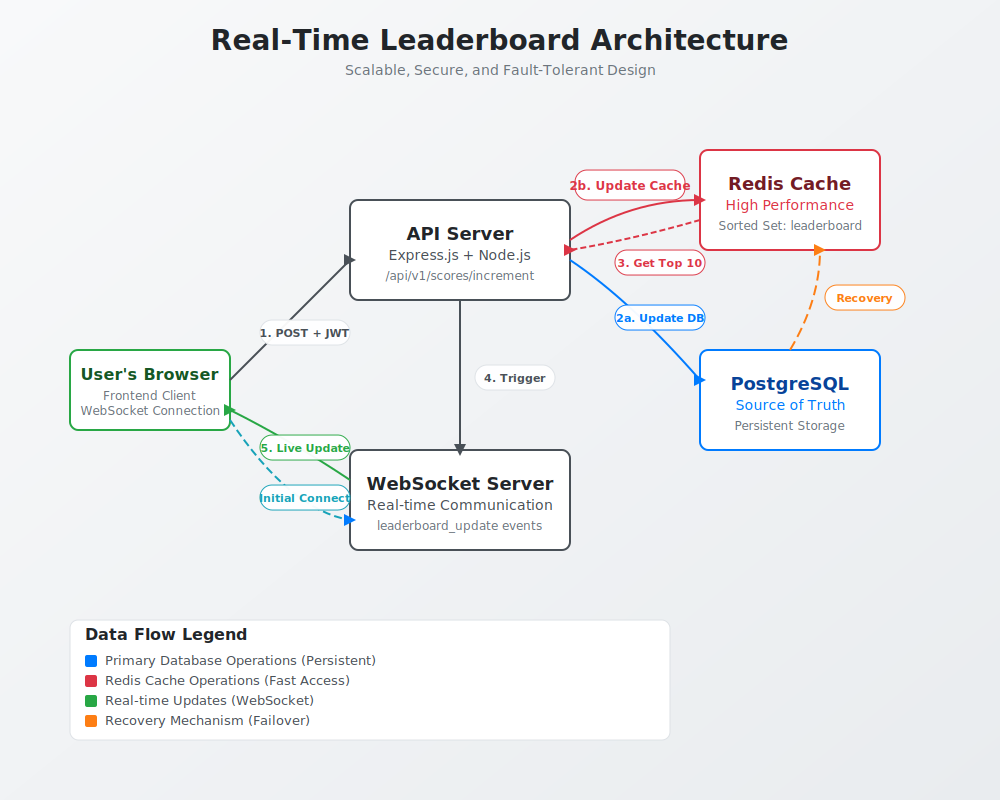

# Real-Time Leaderboard Service Specification

## 1. Overview

This document specifies the architecture and design for a real-time leaderboard service. The service will handle score updates from users, maintain a leaderboard of the top 10 scores, and push live updates to all connected clients. The primary goal is to create a secure, scalable, and low-latency system.

## 2. Architecture

The proposed architecture consists of a backend API server with WebSocket capabilities, a Redis database for efficient data management, and a JWT-based authentication system to secure the service.

### 2.1. Components

-   **API Server**: A Node.js application built with Express.js. It exposes a RESTful endpoint for score updates.
-   **WebSocket Server**: Integrated into the API server (using a library like `socket.io` or `ws`) to push real-time updates to clients.
-   **Redis Database**: Used as the primary data store for the leaderboard. Redis's Sorted Set data structure is highly efficient for this use case, providing O(log(N)) time complexity for updates and O(log(N)+M) for retrievals (where N is the number of users and M is the number of users being retrieved).
-   **Persistent Database**: A PostgreSQL/MySQL database serves as the source of truth for user scores, ensuring data durability and recovery capabilities.
-   **Authentication**: JSON Web Tokens (JWT) will be used to secure the score update endpoint.

### 2.2. Architecture Diagram

The following diagram illustrates the flow of data and interactions between the components.



### 2.3. Execution Flow

1.  **Initial Connection**: A user opens the website, and the frontend establishes a WebSocket connection with the server to receive live leaderboard updates. The server sends the current top 10 scores upon connection.
2.  **User Action**: The user performs an action in the frontend that results in a score increase.
3.  **API Call**: The frontend sends a `POST` request to the `/api/v1/scores/increment` endpoint. The request must include a valid JWT in the `Authorization` header.
4.  **Authentication & Authorization**: The API server intercepts the request and validates the JWT. If the token is valid, it extracts the user's identity.
5.  **Dual Write Strategy**: The server performs two operations:
    - **Primary Database Update**: Updates the user's score in the persistent database (PostgreSQL/MySQL) to ensure data durability.
    - **Cache Update**: Updates the Redis Sorted Set (`leaderboard`) for fast leaderboard queries.
6.  **Leaderboard Retrieval**: The server queries Redis to get the updated top 10 leaderboard.
7.  **Broadcast Update**: The new leaderboard is broadcasted to all connected clients via the WebSocket server through a `leaderboard_update` event.
8.  **Live Update**: The frontend receives the WebSocket event and updates the scoreboard UI in real-time.

## 3. API Specification

### 3.1. REST API

#### `POST /api/v1/scores/increment`

-   **Description**: Increments the score for the authenticated user.
-   **Headers**:
    -   `Authorization: Bearer <jwt_token>`
-   **Request Body**:
    ```json
    {
      "points": 10
    }
    ```
-   **Responses**:
    -   `200 OK`: If the score is updated successfully.
        ```json
        {
          "success": true,
          "newScore": 150
        }
        ```
    -   `401 Unauthorized`: If the JWT is missing or invalid.
    -   `400 Bad Request`: If the request body is invalid.

### 3.2. WebSocket Events

-   **Connection**: The client connects to the WebSocket endpoint (e.g., `ws://your-domain.com`).
-   **Server -> Client**:
    -   `leaderboard_update`: The server sends this event whenever the leaderboard changes. The payload contains the new leaderboard.
        ```json
        {
          "leaderboard": [
            { "userId": "user123", "score": 5000 },
            { "userId": "user456", "score": 4800 },
            ...
          ]
        }
        ```

## 4. Data Models

### 4.1. Persistent Database (PostgreSQL/MySQL)
```sql
CREATE TABLE user_scores (
    user_id VARCHAR(255) PRIMARY KEY,
    score INTEGER NOT NULL DEFAULT 0,
    updated_at TIMESTAMP DEFAULT CURRENT_TIMESTAMP
);
```

### 4.2. Redis Cache
-   **User Score (in Redis Sorted Set)**:
    -   **Key**: `leaderboard`
    -   **Score**: The user's total score (integer).
    -   **Member**: The user's ID (string).

## 5. Data Persistence Strategy

### 5.1. Dual Storage Approach
To address data durability concerns while maintaining high performance:

1. **Primary Storage**: PostgreSQL/MySQL database as the source of truth
   - All score updates are persisted here
   - Survives system crashes and power outages
   - Provides ACID compliance and data integrity

2. **Cache Layer**: Redis for high-performance reads
   - Stores the current leaderboard for fast queries
   - Automatically reconstructed from the primary database if lost

### 5.2. Recovery Mechanisms

#### Cache Warming Strategy
```
On Redis failure/restart:
1. Query top 10 users from primary database: 
   SELECT user_id, score FROM user_scores ORDER BY score DESC LIMIT 10
2. Populate Redis sorted set with this data
3. Resume normal operations
```

#### Data Consistency
- **Write-Through Pattern**: Every score update goes to both primary DB and Redis
- **Fallback Mechanism**: If Redis is unavailable, serve leaderboard from primary database (with higher latency)

## 6. Future Improvements

-   **Scalability**:
    -   **Message Queue**: For very high-traffic systems, decouple score updates from the main request/response cycle. The API endpoint could publish a "score update" event to a message queue (e.g., RabbitMQ, Kafka). A separate worker service would then process these events, update both databases, and trigger the WebSocket broadcast.
    -   **Database Sharding**: For massive scale, consider sharding the primary database by user ID ranges.
    -   **Horizontal Scaling**: The WebSocket server can be scaled horizontally. To ensure that updates are broadcast to all clients across all instances, a Redis Pub/Sub channel can be used to communicate between the server instances.
-   **Data Consistency**:
    -   **Event Sourcing**: Implement event sourcing to maintain a complete audit trail of all score changes.
    -   **CQRS Pattern**: Separate read and write models for even better performance optimization.
-   **Security**:
    -   **Rate Limiting**: Implement rate limiting on the score update endpoint to prevent abuse.
    -   **More Granular Authorization**: Implement more complex authorization logic if needed (e.g., checking if the user is eligible to receive points for a specific action).
-   **Monitoring & Observability**:
    -   **Health Checks**: Implement health checks for both Redis and primary database connectivity.
    -   **Metrics**: Track cache hit rates, database response times, and WebSocket connection counts.
    -   **Alerting**: Set up alerts for Redis failures and automatic failover procedures.
-   **Analytics**:
    -   Track score update events and user engagement for analytics purposes. This data can be sent to a data warehouse or analytics service.
